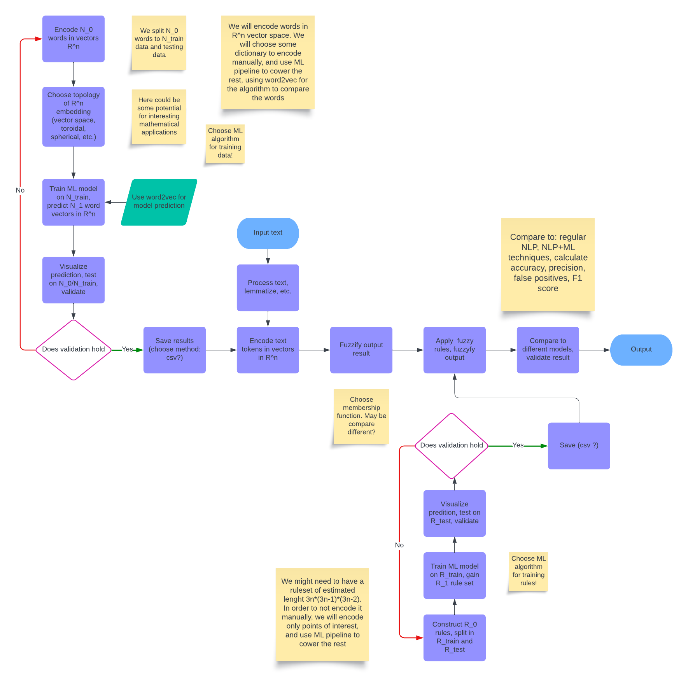

# Application of Fuzzy Logic to Natural Language Processing

This is a repository for scientific ideas and solutions on the topic of fuzzy logic and NLP.

General approach outlined in this flowchart: 

## Ideas:

- telegram bot
- web scraping ?
- find better data
- 
- 
 

## Topics:

- semantic
- disinformation
- sarcasm
- medicine?
- movies?
- text professionality 
- manipulation in text
- shortness/brevity of text
- financial markers 
- marketing: is product represented on market?

